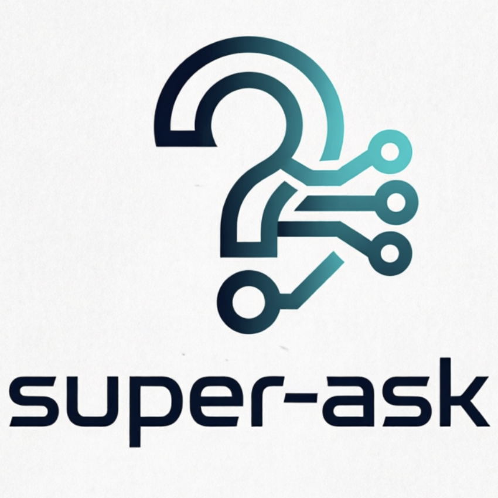

<p align="center">
  
</p>

<h1 align="center">Super Ask</h1>

<p align="center">
  <a href="#中文">中文</a> | <a href="#english">English</a>
</p>

---

# 中文

> 让 AI Agent 在关键节点暂停，等待人类反馈后再继续。

## 概述

Super Ask 是一个多轮人机交互中间件，适用于各种 AI 编程 Agent（Cursor、VS Code Copilot、Codex、OpenCode、Qwen CLI 等）。

Agent 在执行任务的过程中，可以随时调用 Super Ask 向用户汇报进展、提问、等待反馈，然后根据反馈继续工作——形成闭环。

### 为什么需要 Super Ask？

| 痛点 | Super Ask 如何解决 |
|---|---|
| Agent 执行完才告知结果，方向跑偏难纠正 | Agent 可在任意节点暂停汇报，用户实时审阅 |
| 多个 Agent 并行时无法统一管理 | Web UI 集中管理所有 Agent 的会话 |
| 不同 IDE / Agent 工具碎片化 | 统一协议，一套规则适配 Cursor / Copilot / Codex / OpenCode / Qwen |

## 架构

```
┌─────────────┐     ┌─────────────┐     ┌──────────────┐
│  Cursor      │     │  VS Code    │     │  Codex CLI   │
│  Agent       │     │  Copilot    │     │  Agent       │
└──────┬───────┘     └──────┬──────┘     └──────┬───────┘
       │ Shell               │ Shell / LM Tool     │ Shell
       ▼                     ▼                     ▼
┌──────────────────────────────────────────────────────────┐
│              Python CLI (super-ask.py)                    │
│       POST /super-ask  ─────►  阻塞等待用户回复           │
└──────────────────────────┬───────────────────────────────┘
                           │ HTTP + Bearer Token
                           ▼
┌──────────────────────────────────────────────────────────┐
│              Node.js Server (默认端口 19960)               │
│  ┌──────────┐  ┌─────────────┐  ┌────────────────────┐  │
│  │ 会话管理  │  │  部署引擎    │  │  上传 / Pin / Tag  │  │
│  └──────────┘  └─────────────┘  └────────────────────┘  │
│                    WebSocket 实时推送                      │
└──────────────────────┬───────────────────────────────────┘
                       ▼
┌──────────────────────────────────────────────────────────┐
│                React Web UI (Vite)                        │
│  ┌──────────┐  ┌──────────┐  ┌──────────┐  ┌─────────┐ │
│  │ 会话列表  │  │ 聊天视图  │  │ 部署面板  │  │  设置   │ │
│  └──────────┘  └──────────┘  └──────────┘  └─────────┘ │
└──────────────────────────────────────────────────────────┘
```

## 核心特性

- **多平台支持**：Cursor、VS Code Copilot、Codex、OpenCode、Qwen CLI，一键部署规则
- **Web UI 仪表盘**：集中查看和管理所有 Agent 会话，WebSocket 实时消息推送
- **阻塞式交互**：Agent 调用后暂停等待，用户回复后自动继续
- **消息队列**：用户可预先编写回复，Agent 下次提问时自动发送
- **会话管理**：Pin 消息、自定义标签、来源标识、工作区关联
- **预定义消息**：配置常用回复后缀，一键附加到回复中
- **文件附件**：支持上传图片等文件作为附件
- **安全鉴权**：共享密钥机制保护本地 API 和 WebSocket
- **国际化**：中英文双语 UI

## 快速开始

### 环境要求

- **Node.js** ≥ 18
- **Python** 3
- macOS / Linux

### 安装与启动

```bash
git clone https://github.com/bdliyq/super-ask.git
cd super-ask
bash install.sh
```

`install.sh` 会自动完成：安装依赖 → 构建 UI → 构建 Server → 后台启动 → 打开浏览器。

自定义端口：

```bash
bash install.sh 8080
```

### 服务管理

```bash
# 查看状态
node server/dist/index.js status

# 停止服务
node server/dist/index.js stop

# 重启
bash install.sh
```

## 部署规则到 Agent

打开 Web UI → 设置 → 部署面板，选择平台和范围即可一键部署。

| 平台 | 规则文件位置 | 范围 |
|---|---|---|
| **Cursor** | `.cursor/rules/super-ask.mdc` | 工作区 / 用户全局 |
| **VS Code Copilot** | `.copilot/instructions/super-ask.instructions.md` | 工作区 / 用户全局 |
| **Codex** | `AGENTS.md`（注入标记块） | 工作区 / 用户全局 |
| **OpenCode** | `AGENTS.md` + `.opencode/tools/super-ask.ts`（用户级为 `~/.config/opencode/...`） | 工作区 / 用户全局 |
| **Qwen CLI** | `super-ask-qwen.md` + `.qwen/settings.json` | 工作区 / 用户全局 |

部署后，Agent 会在每次任务完成时自动调用 Super Ask 汇报并等待反馈。
其中 OpenCode 会通过自定义工具直接调用 super-ask HTTP API，并自动读取本机 `~/.super-ask` 配置与 token。
OpenCode 自定义工具模板基于官方 `@opencode-ai/plugin` 接口约定生成。

## 交互流程

```
┌──────────┐                    ┌──────────┐                ┌──────────┐
│  Agent   │                    │  Server  │                │   用户   │
│  (IDE)   │                    │ (19960)  │                │ (Web UI) │
└────┬─────┘                    └────┬─────┘                └────┬─────┘
     │                               │                           │
     │  1. 调用 super-ask CLI        │                           │
     │  --summary "完成了 X"          │                           │
     │ ─────────────────────────────►│                           │
     │       （阻塞等待）             │   2. WebSocket 推送       │
     │                               │ ─────────────────────────►│
     │                               │                           │
     │                               │   3. 用户查看并回复        │
     │                               │◄───────────────────────── │
     │   4. 返回 JSON                │                           │
     │◄───────────────────────────── │                           │
     │                               │                           │
     │  5. 解析 feedback 继续工作     │                           │
```

## CLI 用法

```bash
python3 cli/super-ask.py \
  --summary '## 工作汇报
- 已完成 X
- 结果：Y' \
  --question '请确认是否继续？' \
  --title '任务标题' \
  --session-id '<上次返回的 chatSessionId>' \
  --source cursor \
  --workspace-root /path/to/project \
  --options '继续' '修改' '取消'
```

### 参数说明

| 参数 | 必填 | 说明 |
|---|---|---|
| `--summary` | ✅ | Markdown 格式的汇报内容 |
| `--question` | ✅ | 向用户提出的问题 |
| `--title` | | Tab 标题 |
| `--session-id` | | 多轮对话的会话 ID（首次不传，从响应中获取） |
| `--source` | | 来源标识（cursor / vscode / codex / opencode / qwen） |
| `--workspace-root` | | 工作区绝对路径 |
| `--options` | | 快捷回复选项（可多个） |
| `--port` | | 服务端口（默认 19960） |
| `--retries` | | 连接失败重试次数（默认 3） |

### 返回值

```json
{
  "chatSessionId": "abc-123-...",
  "feedback": "用户的回复文本"
}
```

## 项目结构

```
super-ask/
├── cli/                    # Python CLI 客户端
│   └── super-ask.py
├── server/                 # Node.js 服务端
│   ├── src/
│   │   ├── index.ts        # 入口（start / stop / status + daemon）
│   │   ├── server.ts       # HTTP 路由 + 静态文件服务
│   │   ├── sessionManager.ts  # 会话管理、阻塞请求、持久化
│   │   ├── wsHub.ts        # WebSocket 广播中心
│   │   ├── deployManager.ts   # 规则部署引擎
│   │   ├── config.ts       # 配置加载 + Token 管理
│   │   └── pidManager.ts   # PID 文件管理
│   └── static/             # UI 构建产物（自动生成）
├── ui/                     # React Web UI（Vite）
│   └── src/
│       ├── App.tsx          # 主入口
│       ├── auth.ts          # Token 鉴权
│       ├── components/      # ChatView, SessionTabs, DeployPanel 等
│       ├── hooks/           # useWebSocket, useSessions
│       ├── i18n/            # 国际化
│       └── styles/          # 样式
├── shared/                 # 共享 TypeScript 类型定义
│   └── types.ts
├── rules/                  # Agent 规则模板
│   ├── super-ask.md         # 通用版
│   ├── super-ask-cursor.mdc # Cursor 版
│   ├── super-ask-copilot.md # Copilot 版
│   ├── super-ask-codex.md   # Codex 版
│   ├── super-ask-opencode.md # OpenCode 规则
│   ├── super-ask-opencode-tool.ts # OpenCode 自定义工具模板
│   └── super-ask-qwen.md    # Qwen 版
├── vscode/                 # VS Code 扩展（可选）
├── scripts/                # launchd 安装 / 卸载、npm-link
├── install.sh              # 一键构建与启动脚本
└── agent.md                # 架构设计文档
```

## 配置

配置文件位于 `~/.super-ask/config.json`：

```json
{
  "port": 19960,
  "host": "127.0.0.1",
  "sessionTimeout": 86400000,
  "maxSessions": 100
}
```

| 字段 | 默认值 | 说明 |
|---|---|---|
| `port` | `19960` | 监听端口 |
| `host` | `127.0.0.1` | 绑定地址 |
| `sessionTimeout` | `86400000` (24h) | 会话空闲超时（毫秒） |
| `maxSessions` | `100` | 最大并发会话数 |

### 数据目录 `~/.super-ask/`

| 文件 | 用途 |
|---|---|
| `config.json` | 服务配置 |
| `token` | 鉴权密钥（自动生成，权限 0600） |
| `predefined-msgs.json` | 预定义消息 |
| `sessions/` | 会话持久化（一文件一会话） |
| `uploads/` | 上传的附件文件 |
| `logs/` | 服务日志（自动轮转） |

## 安全

- 服务默认只绑定 `127.0.0.1`，仅本机可访问
- 所有敏感 API 和 WebSocket 连接需要 Bearer Token 鉴权
- Token 在服务首次启动时自动生成，存储在 `~/.super-ask/token`（权限 0600）
- CLI 自动读取 token 文件，无需手动配置

## 技术栈

| 组件 | 技术 |
|---|---|
| 服务端 | Node.js, TypeScript, ws, tsup |
| Web UI | React 19, Vite 6, react-markdown |
| CLI | Python 3（仅标准库） |
| VS Code 扩展 | VS Code Extension API, esbuild |

---

# English

> Let AI agents pause at checkpoints, wait for human feedback, then continue.

## Overview

Super Ask is a multi-round human-in-the-loop middleware for AI coding agents (Cursor, VS Code Copilot, Codex, OpenCode, Qwen CLI, etc.).

During task execution, agents can call Super Ask at any point to report progress, ask questions, and wait for user feedback before continuing — forming a closed feedback loop.

### Why Super Ask?

| Pain Point | How Super Ask Solves It |
|---|---|
| Agent runs to completion; hard to course-correct mid-task | Agent pauses at any checkpoint for real-time review |
| No unified view when running multiple agents in parallel | Web UI provides a single dashboard for all agent sessions |
| Fragmented tools across different IDEs and agents | One protocol, one set of rules for Cursor / Copilot / Codex / OpenCode / Qwen |

## Architecture

```
┌─────────────┐     ┌─────────────┐     ┌──────────────┐
│  Cursor      │     │  VS Code    │     │  Codex CLI   │
│  Agent       │     │  Copilot    │     │  Agent       │
└──────┬───────┘     └──────┬──────┘     └──────┬───────┘
       │ Shell               │ Shell / LM Tool     │ Shell
       ▼                     ▼                     ▼
┌──────────────────────────────────────────────────────────┐
│              Python CLI (super-ask.py)                    │
│       POST /super-ask  ─────►  Blocks until user replies  │
└──────────────────────────┬───────────────────────────────┘
                           │ HTTP + Bearer Token
                           ▼
┌──────────────────────────────────────────────────────────┐
│              Node.js Server (default port 19960)          │
│  ┌──────────┐  ┌─────────────┐  ┌────────────────────┐  │
│  │ Session   │  │  Deploy     │  │  Upload / Pin /    │  │
│  │ Manager   │  │  Engine     │  │  Tag APIs          │  │
│  └──────────┘  └─────────────┘  └────────────────────┘  │
│                    WebSocket Real-time Push               │
└──────────────────────┬───────────────────────────────────┘
                       ▼
┌──────────────────────────────────────────────────────────┐
│                React Web UI (Vite)                        │
│  ┌──────────┐  ┌──────────┐  ┌──────────┐  ┌─────────┐ │
│  │ Sessions  │  │ Chat View│  │ Deploy   │  │Settings │ │
│  └──────────┘  └──────────┘  └──────────┘  └─────────┘ │
└──────────────────────────────────────────────────────────┘
```

## Key Features

- **Multi-platform**: Cursor, VS Code Copilot, Codex, OpenCode, Qwen CLI — one-click rule deployment
- **Web UI Dashboard**: Centralized view for all agent sessions with real-time WebSocket updates
- **Blocking Interaction**: Agent blocks until the user replies, then continues automatically
- **Reply Queue**: Pre-compose replies that auto-send when the agent asks next
- **Session Management**: Pin messages, custom tags, source badges, workspace association
- **Predefined Messages**: Configure reusable reply suffixes
- **File Attachments**: Upload and attach images/files to replies
- **Auth**: Shared-secret token protects local API and WebSocket endpoints
- **i18n**: Chinese / English bilingual UI

## Quick Start

### Prerequisites

- **Node.js** ≥ 18
- **Python** 3
- macOS / Linux

### Install & Start

```bash
git clone https://github.com/bdliyq/super-ask.git
cd super-ask
bash install.sh
```

`install.sh` automatically: installs dependencies → builds UI → builds server → starts in background → opens browser.

Custom port:

```bash
bash install.sh 8080
```

### Service Management

```bash
# Check status
node server/dist/index.js status

# Stop
node server/dist/index.js stop

# Restart
bash install.sh
```

## Deploy Rules to Agents

Open Web UI → Settings → Deploy panel, select platforms and scope for one-click deployment.

| Platform | Rule Location | Scope |
|---|---|---|
| **Cursor** | `.cursor/rules/super-ask.mdc` | Workspace / User-global |
| **VS Code Copilot** | `.copilot/instructions/super-ask.instructions.md` | Workspace / User-global |
| **Codex** | `AGENTS.md` (injected marked block) | Workspace / User-global |
| **OpenCode** | `AGENTS.md` + `.opencode/tools/super-ask.ts` (user-global lives under `~/.config/opencode/...`) | Workspace / User-global |
| **Qwen CLI** | `super-ask-qwen.md` + `.qwen/settings.json` | Workspace / User-global |

After deployment, agents automatically call Super Ask to report and wait for feedback at each task checkpoint.
For OpenCode, deployment also installs a custom tool that talks to the super-ask HTTP API directly and auto-loads local `~/.super-ask` config and auth token.
The OpenCode custom tool template is generated against the official `@opencode-ai/plugin` tool contract.

## Interaction Flow

```
┌──────────┐                    ┌──────────┐                ┌──────────┐
│  Agent   │                    │  Server  │                │   User   │
│  (IDE)   │                    │ (19960)  │                │ (Web UI) │
└────┬─────┘                    └────┬─────┘                └────┬─────┘
     │                               │                           │
     │  1. Call super-ask CLI        │                           │
     │  --summary "Completed X"      │                           │
     │ ─────────────────────────────►│                           │
     │       (blocks)                │   2. WebSocket push       │
     │                               │ ─────────────────────────►│
     │                               │                           │
     │                               │   3. User reviews & replies│
     │                               │◄───────────────────────── │
     │   4. Returns JSON             │                           │
     │◄───────────────────────────── │                           │
     │                               │                           │
     │  5. Parses feedback, continues│                           │
```

## CLI Usage

```bash
python3 cli/super-ask.py \
  --summary '## Progress Report
- Completed X
- Result: Y' \
  --question 'Should I continue?' \
  --title 'Task Title' \
  --session-id '<chatSessionId from previous response>' \
  --source cursor \
  --workspace-root /path/to/project \
  --options 'Continue' 'Modify' 'Cancel'
```

### Parameters

| Parameter | Required | Description |
|---|---|---|
| `--summary` | ✅ | Markdown-formatted progress report |
| `--question` | ✅ | Question for the user |
| `--title` | | Tab title |
| `--session-id` | | Session ID for multi-round conversations (omit on first call) |
| `--source` | | Source identifier (cursor / vscode / codex / opencode / qwen) |
| `--workspace-root` | | Absolute path to the workspace |
| `--options` | | Quick-reply options (multiple allowed) |
| `--port` | | Server port (default 19960) |
| `--retries` | | Connection failure retry count (default 3) |

### Response

```json
{
  "chatSessionId": "abc-123-...",
  "feedback": "User's reply text"
}
```

## Project Structure

```
super-ask/
├── cli/                    # Python CLI client
│   └── super-ask.py
├── server/                 # Node.js server
│   ├── src/
│   │   ├── index.ts        # Entry (start / stop / status + daemon)
│   │   ├── server.ts       # HTTP routes + static file serving
│   │   ├── sessionManager.ts  # Session management, blocking requests, persistence
│   │   ├── wsHub.ts        # WebSocket broadcast hub
│   │   ├── deployManager.ts   # Rule deployment engine
│   │   ├── config.ts       # Config loading + token management
│   │   └── pidManager.ts   # PID file management
│   └── static/             # Built UI assets (auto-generated)
├── ui/                     # React Web UI (Vite)
│   └── src/
│       ├── App.tsx          # Main entry
│       ├── auth.ts          # Token authentication
│       ├── components/      # ChatView, SessionTabs, DeployPanel, etc.
│       ├── hooks/           # useWebSocket, useSessions
│       ├── i18n/            # Internationalization
│       └── styles/          # Stylesheets
├── shared/                 # Shared TypeScript type definitions
│   └── types.ts
├── rules/                  # Agent rule templates
│   ├── super-ask.md         # Generic
│   ├── super-ask-cursor.mdc # Cursor
│   ├── super-ask-copilot.md # Copilot
│   ├── super-ask-codex.md   # Codex
│   ├── super-ask-opencode.md # OpenCode rules
│   ├── super-ask-opencode-tool.ts # OpenCode custom tool template
│   └── super-ask-qwen.md    # Qwen
├── vscode/                 # VS Code extension (optional)
├── scripts/                # launchd install/uninstall, npm-link
├── install.sh              # One-shot build & start script
└── agent.md                # Architecture design document
```

## Configuration

Config file: `~/.super-ask/config.json`

```json
{
  "port": 19960,
  "host": "127.0.0.1",
  "sessionTimeout": 86400000,
  "maxSessions": 100
}
```

| Field | Default | Description |
|---|---|---|
| `port` | `19960` | Listen port |
| `host` | `127.0.0.1` | Bind address |
| `sessionTimeout` | `86400000` (24h) | Session idle timeout in ms |
| `maxSessions` | `100` | Max concurrent sessions |

### Data Directory `~/.super-ask/`

| File | Purpose |
|---|---|
| `config.json` | Server configuration |
| `token` | Auth token (auto-generated, mode 0600) |
| `predefined-msgs.json` | Predefined reply messages |
| `sessions/` | Session persistence (one file per session) |
| `uploads/` | Uploaded attachment files |
| `logs/` | Server logs (auto-rotating) |

## Security

- Server binds to `127.0.0.1` by default (localhost only)
- All sensitive APIs and WebSocket connections require Bearer Token authentication
- Token is auto-generated on first server start, stored in `~/.super-ask/token` (mode 0600)
- CLI reads the token file automatically; no manual configuration needed

## Tech Stack

| Component | Technology |
|---|---|
| Server | Node.js, TypeScript, ws, tsup |
| Web UI | React 19, Vite 6, react-markdown |
| CLI | Python 3 (stdlib only) |
| VS Code Extension | VS Code Extension API, esbuild |

## License

MIT
