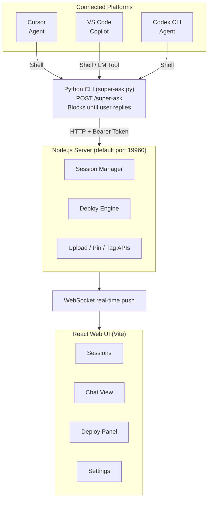

## Overview

Super Ask is a multi-round human-in-the-loop middleware for AI coding agents (Cursor, VS Code Copilot, Codex, OpenCode, Qwen CLI, etc.).

During task execution, agents can call Super Ask at any point to report progress, ask questions, and wait for user feedback before continuing — forming a closed feedback loop.

### Why Super Ask?

| Pain Point | How Super Ask Solves It |
|---|---|
| Agent runs to completion; hard to course-correct mid-task | Agent pauses at any checkpoint for real-time review |
| No unified view when running multiple agents in parallel | Web UI provides a single dashboard for all agent sessions |
| Fragmented tools across different IDEs and agents | One protocol, one set of rules for Cursor / Copilot / Codex / OpenCode / Qwen |

## Architecture

## Key Features

- **Multi-platform**: Cursor, VS Code Copilot, Codex, OpenCode, Qwen CLI — one-click rule deployment
- **Web UI Dashboard**: Centralized view for all agent sessions with real-time WebSocket updates
- **Blocking Interaction**: Agent blocks until the user replies, then continues automatically
- **Reply Queue**: Pre-compose replies that auto-send when the agent asks next
- **Session Management**: Pin messages, custom tags, source badges, workspace association
- **Predefined Messages**: Configure reusable reply suffixes
- **File Attachments**: Upload and attach images/files to replies
- **Auth**: Shared-secret token protects local API and WebSocket endpoints
- **i18n**: Chinese / English bilingual UI

## Contact

- Email: [support@aidb.live](mailto:support@aidb.live)
- GitHub: [bdliyq/super-ask](https://github.com/bdliyq/super-ask)
