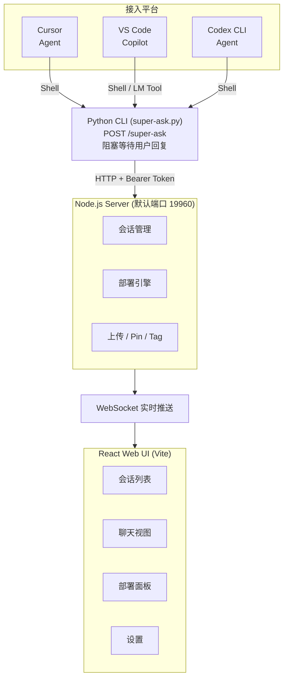

## 概述

Super Ask 是一个多轮人机交互中间件，适用于各种 AI 编程 Agent（Cursor、VS Code Copilot、Codex、OpenCode、Qwen CLI 等）。

Agent 在执行任务的过程中，可以随时调用 Super Ask 向用户汇报进展、提问、等待反馈，然后根据反馈继续工作——形成闭环。

### 为什么需要 Super Ask？

| 痛点 | Super Ask 如何解决 |
|---|---|
| Agent 执行完才告知结果，方向跑偏难纠正 | Agent 可在任意节点暂停汇报，用户实时审阅 |
| 多个 Agent 并行时无法统一管理 | Web UI 集中管理所有 Agent 的会话 |
| 不同 IDE / Agent 工具碎片化 | 统一协议，一套规则适配 Cursor / Copilot / Codex / OpenCode / Qwen |

## 架构

## 核心特性

- **多平台支持**：Cursor、VS Code Copilot、Codex、OpenCode、Qwen CLI，一键部署规则
- **Web UI 仪表盘**：集中查看和管理所有 Agent 会话，WebSocket 实时消息推送
- **阻塞式交互**：Agent 调用后暂停等待，用户回复后自动继续
- **消息队列**：用户可预先编写回复，Agent 下次提问时自动发送
- **会话管理**：Pin 消息、自定义标签、来源标识、工作区关联
- **预定义消息**：配置常用回复后缀，一键附加到回复中
- **文件附件**：支持上传图片等文件作为附件
- **安全鉴权**：共享密钥机制保护本地 API 和 WebSocket
- **国际化**：中英文双语 UI

## 联系方式

- 邮箱：[support@aidb.live](mailto:support@aidb.live)
- GitHub：[bdliyq/super-ask](https://github.com/bdliyq/super-ask)
